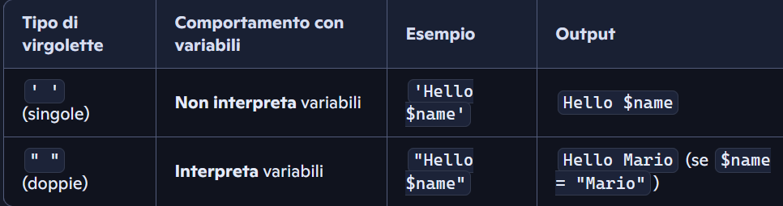

una best practice sarebbe chiamare i fil econtenuti in include con
'Esempio.inc.php' per determinare che il file non ha codice da far partire da
solo

Ho visto molto spesso fare
``<h1><?php   echo 'Ciao'; ?>```</h1>`quando io ho sempre fatto``<?php echo' <h1> Cioa <h1>'; ?>``
Non ho ancora capito la differenza ma funzionano uguale

Quando fa include non mette i tag Html nell´eco , capire anche questo !!!!

#################### **ANNOTAZIONE INTERESSANTE**
''''################################

Feci un´inlude dove avevo l´header , in questo file ho fatto una funzione per
richiedere il parametro title che dovesse avere l´header. Cosa molto piu
interessante é stato vedere che si puo benissimo mettere una variabile php nel
Tag title e poi direttamente nel file della pagina dichiarare questa variabile
con un valore diverso e farlo acnhe per l´immagini !!!!!! Tenere a mente
!!!!!!!!!!

Piccolo appunto : `<?php echo ' I'm a string'; ?>` ora per come ragiona il
linguaggio mi darebbe errore perche " I'm " ha comunque un single Quot per non
avere problemi si puo usareil back slash '\' che fa capire al linguaggio che il
single Quot perde di valore sintattico ed é solo Str . QUINDI :
`<?php echo ' I\'m a string'; ?>` --> FORMATTAZIONE GIUSTA !!!

    Relativo: "DBMS.php" → cerca nella stessa cartella.

    Assoluto: "http://localhost/mio_progetto/DBMS.php" → sicuro se vuoi evitare confusione.

##############################################################################
**STRING**
###########################################################################################################


NOTARE come il dot ' . ' in php viene usato per concatenare piu stringhe , come
il ' + ' in PYthon o altri linguaggi

con i Doble Quot questo problema non ci sta ed é best practise racchiudere {
$esenpio } le variabili o ogni cosa che metti attaccato alla variabile
puottrebbe dare problema

\n e
`<br> anche se anno la stessa fiunzione , lo fanno in modo diverso . La prima viene interpretata come parte della formattazione nel codice e non nel browser che legge i tag , quindi capire quando usare una o l´altra`

\t simbolo per il tab che aggiunge spazio

la vera differenza tra single or double Quot sta nel fatto che se voglio solo
stampare del testo uso il single perche sono sicuro che il computer non ha delle
incomprensioni con parte del testo che sembra variabile o altri comandi . Per
tutto il resto usa il double con le **{ }** per le variabli



########################################################## **NUMBERS**
#############################################################

Cosa fa `round(3.33, 1)`

- **Funzione round** ( _Rundungsfunktion_ ): serve ad **arrotondare un numero**
  .
- **Primo argomento** : il numero → `3.33`.
- **Secondo argomento** : le cifre decimali → `1`

Si usa anche *=, /= , -= , += e cosi via

**DA NON CONFONDERE CON RAND ---> RANDOM !!!!!**

**rand(0 , 5);**

Questo crea una selezione randomica di numeri !!!!!

###################################################### **VAR_DUMP**
#################################################################

`var_dump()` in PHP

- È una **funzione di debug** ( _Debug-Funktion_ ).
- Mostra **tipo** ( _Typ_ ) e **valore** ( _Wert_ ) di una variabile.

| **echo** | Mostra solo il contenuto come stringa | `Array`(non mostra i valori) |
| -------- | ------------------------------------- | ---------------------------- |

| **print_r()** | Mostra valore in modo leggibile (anche array/oggetti) | `Array ( [0] => 1 [1] => 2 [2] => 3 )` |
| ------------- | ----------------------------------------------------- | -------------------------------------- |

| **var_dump()** | Mostra tipo + lunghezza + valore (dettagliato) | `array(3) { [0]=> int(1) [1]=> int(2) [2]=> int(3) }` |
| -------------- | ---------------------------------------------- | ----------------------------------------------------- |

###################### **Isset Empty and Unset Function Validate and delete
Variable** #############################

- La funziona ' **isset ( $nome_variabile )** ' serve per vedere se questa
  Varabile esiste , ritornera un boolean True/False.

  riesci a vedere il valore del boolea se lo racchiudi in una**var_dump()** tipo
  : **var_dump( isset ( $nome_variabile ) );**

  se metti tutto in una **if** non porta il Warning se la variabile non esiste
  !!!!!!!!!!

* La funziona ' **empty ( $nome_variabile )** ' serve per vedere se questa
  Varabile é vuota , ritornera un boolean True/False. se é vuota ritorna un true
  !!!! **ATTENZIONE nella funzione empty() se inserisco lo ' 0 ' viene
  considerato come vuoto !!!!!!!**
* **unset($nome_variabile)** serve per cancellare direttamento la variabile
  senza l´**overriding** o cancellare meccanicamente la varibile !!!!!

#################################### **ALTERNATIV SINTAX**
#####################################################

Una sintassi alternativa per eliminare i **{}** si potrebbe fare per esempio :

**if (.........) : switch (.......) :**

**endif; 		case ......:**

** break;**

** endswitch;**

NOTA BENE !!!!!

$isRed = true;

**<h1 `<?php if (!empty($isRed)) : ?>` style = "color : red;" `<?php endif; ?>`>
PHP is amazing!`</h1>`**

ALTRO MODO DA ANALIZZARE PERCHE NON L´HO MAI VISTO !!!!

############################################################################################################

###### OR (|| oppure `or`) – **disgiunzione XOR (^ oppure `xor`) – **disgiunzione esclusiva****

Vero se **almeno uno** è vero. Vero se **solo uno** è vero, ma non entrambi.

    A B | A OR B                                                                                                            A B | A XOR B
    	0 0 |   0                                                                                                                    0 0 |    0
    	0 1 |   1             													0 1 |    1
    	1 0 |   1															1 0 |    1
    	1 1 |   1															1 1 |    0

############################################ **ARRAY**
#############################################################

$frutta = **array(** 'banane' , 'lamponi' ,'ciliegie' , 'mango', 'ananas'**);**

Se proviamo a stamparlo cosi mi da waning con echo , si puo stampare con
**var_dump( ' nome_lista ' );** **ES:**

array (5) //**contenuto dell´array**

[0] => // **Key** dato automaticamente ma noi possiamo anche inserirne uno a
nostro piacimento

string (n.) "banane" // **tipo del items e quantitá di esso , non che items in
se**

[1] =>

string (n.) "lamponi"

[2] =>

string (n.) "ciliegie"

[3] =>

string (n.) "mango"

[4] =>

string (n.) "ananas"

[99] =>

string (n.) "fragola"

- per stampare con echo ovviamente si fa : **echo $frutta[n.];**
- una cosa carina ma niente di particolare é racchiudere un items in una
  variabile : **da_comprare = $ frutta [0];**
- Best practice : **mettere items dello stesso tipo**
- Modo piu veloce per fare un´array : **$frutta = [ 'banane' , 'lamponi'
  ,'ciliegie' , 'mango', 'ananas' ];**
- altro importante é **count( nome array );**
- **...$nome_array** !!!! MOLTO IMPORTANTE !!!! per spachettare un array dentro
  una funzione o un´altro array per duplicare il contenuto in essa , non si puo
  stampare mi raccomando


**IMPORTANTE !!!!!!**


############################## **OVERRIDE ARRAY** E FUNC PRINCIPALI
##########################################

- **$frutta [ 0 ] = 'Kiwi';**
- **unset ($frutta [0] );** Funzione gia vista per eliminare una value , serve
  anche per gli array !!!!!!**ATTENZIONE**!!!! se cancelli gli altri items non
  scalano di **key** quindi rimangono dove sono e quello cancellato ha un index
  ma é un posto vuoto e non viene stampato
- possiamo inserirne quanti ne vogliamo e mettere la **key** che vogliamo :
  **$frutta[120] = 'Melone';** **!!!! qunidi non si parla di index ma di key
  associato all´items**
- ad ogni modo é sempre meglio usare l´**auto incremento** e lo si fa inserendo
  un items senza inserire la key : **$frutta[ ] = ' mela ';** -----> in questa
  maniera **PHP** usa l´auto increment
- **array_unique( nome dell´array );** serve per creare una copia dell´array
  chiamato in modo da eliminare i valori duplicati in essa , _ovviamente se non
  la racchiudi in un´altra value o non sovrascrivi la vecchia array non lo fa
  automaticamente_ **ES : $frutta = array_unique($$frutta);**
- sort( nome array) ; SORTISCE L´ARRAY


- **min($nome_array);** Trova il valore minimo
- **max($nome_array);** Trova il valore massimo
- **$value = array_merge ( nome_array , nome_array)** Mi serve per conbinare due
  array insieme
- **$[... nome_array , ... nome_array, 'item nuovo']$;** come merge ma piu
  moderno perche mi pemette d´inserire anche altre items insieme
- ... nome array serve per apreire e inserrire tutti i valori dell´array ,
  quindi si usa il contenuto e non l´array in se

######################### ARRAY_SLICE TEORIA
#############################################

- **array_search(contenuto da trovare, $nome_array) ;** Metodo per trovare
  l´index o la key dell´items in questione
- array_slice($nome_array , inizio index , fine index);

Serve per **estrarre una porzione (sottosezione)** di un array **senza
modificarlo** .

FORMA COMPLETA :

**array_slice(array $array, int $offset, ?int $length = null, bool
$preserve_keys = false): array**

La parte `: array` alla fine della funzione serve a **specificare il tipo di
valore che la funzione restituisce** → si chiama **“type hinting di ritorno”**
(in tedesco: _Rückgabetyp_ ).

| Parametro        | Descrizione 🇮🇹                          | Beschreibung 🇩🇪                           |
| ---------------- | --------------------------------------- | ----------------------------------------- |
| `$array`         | L’array di partenza                     | Ausgangsarray                             |
| `$offset`        | Da dove iniziare (indice)               | Startposition                             |
| `$length`        | Quanti elementi prendere                | Anzahl der Elemente                       |
| `$preserve_keys` | Se `true`, mantiene le chiavi originali | Beibehaltung der ursprünglichen Schlüssel |

$numeri = [10, 20, 30, 40, 50];

$parte = array_slice($numeri, 1, 3); print_r($parte);

**RISULTATO**

Array ( [0] => 20 [1] => 30 [2] => 40 )

**Se vuoi mantenere le chiavi:**

$parte = array_slice($numeri, 1, 3, true);

**RISULTATO**

Array ( [1] => 20 [2] => 30 [3] => 40 )

######################################### **Type Hinting di ritorno** — PHP
(Return Types) ####################################

Serve a **specificare il tipo di dato che la funzione deve restituire** .

(non obbligatorio, ma **molto consigliato** per codice pulito e sicuro)

**function somma(int $a, int $b): int { return $a + $b; }**

👉 ritorna sempre un intero (integer) Wenn kein Integer zurückkommt →
PHP-Fehler.

STRING

**function saluta(string $nome): string { return "Ciao, " . $nome; }**

FLOAT

**function divisione(float $a, float $b): float { return $a / $b; }**

BOOL

**function maggioreDiZero(int $n): bool { return $n > 0; }**

ARRAY

**function getNumeri(): array { return [1, 2, 3]; }**

MIXED

**function randomValue(): mixed { return rand(0, 1) ? "ciao" : 123; }**

### **È necessario?**

- ❌ **Non obbligatorio** , ma
- ✅ **Fortemente consigliato** perché:Aiuta a evitare errori di tipo (
  _TypeError_ )

  Rende il codice più leggibile e professionale

  Molti framework moderni (Laravel, Symfony, ecc.) lo richiedono

###################### Associative Arrays ##########################

I valori non piu associato a **index** ma ha **key**


INTERESSANTE VEDERE COME SI USA **FOREACH ()** per stampare sia la key che il
valore !!!

comunque devo stamparli entrambi e vanno uno sotto l´altro , non li stampa come
un´array


**array_keys( nome_array);** mi crea un´altro array dove inserisco solo le keys
dell´array in questione

array_values( nome_array); stessa cosa ma con le value

OVVIAMENTE ENTRAMBE NON CAMBIANO L`ORIGINALE
