< li class="navigation--entry-big entry --search-big" role="menuitem"
data-search="true" aria-haspopup="true">Heir NIX SUCHE `</li>`

una best practice sarebbe chiamare i file contenuti in include con
'Esempio.inc.php' per determinare che il file non ha codice da far partire da
solo

Ho visto molto spesso fare ``<h1><?php   echo 'Ciao'; ?>```</h1>``quando io ho
sempre
fatto`````````````````````<?php echo' <h1> Cioa <h1>'; ?>``````````````````````
Non ho ancora capito la differenza ma funzionano uguale

Quando fa include non mette i tag Html nell´eco , capire anche questo !!!!

#################### **ANNOTAZIONE INTERESSANTE**
''''################################

Feci un´icnlude dove avevo l´header , in questo file ho fatto una funzione per
richiedere il parametro title che dovesse avere l´header. Cosa molto piu
interessante é stato vedere che si puo benissimo mettere una variabile php nel
Tag title e poi direttamente nel file della pagina dichiarare questa variabile
con un valore diverso e farlo acnhe per l´immagini !!!!!! Tenere a mente
!!!!!!!!!!

Piccolo appunto : `<?php echo ' I'm a string'; ?>` ora per come ragiona il
linguaggio mi darebbe errore perche " I'm " ha comunque un single Quot per non
avere problemi si puo usareil back slash '\' che fa capire al linguaggio che il
single Quot perde di valore sintattico ed é solo Str . QUINDI :
`<?php echo ' I\'m a string'; ?>` --> FORMATTAZIONE GIUSTA !!!

    Relativo: "DBMS.php" → cerca nella stessa cartella.

    Assoluto: "http://localhost/mio_progetto/DBMS.php" → sicuro se vuoi evitare confusione.

    @ A COSA SERVE ??

ES:

$name = @(string) $_GET['name'];

**Funzione del `@`:**

- Se qualcosa genera un **errore o warning** , PHP **non lo mostra** a schermo.
- Esempio: se `$_GET['name']` non esiste o ha un tipo non convertibile, PHP non
  mostrerà alcun avviso.

##############################################################################
**STRING**
###########################################################################################################


NOTARE come il dot ' . ' in php viene usato per concatenare piu stringhe , come
il ' + ' in PYthon o altri linguaggi

con i Doble Quot questo problema non ci sta ed é best practise racchiudere {
$esenpio } le variabili o ogni cosa che metti attaccato alla variabile
puottrebbe dare problema

\n e
`<br> anche se anno la stessa fiunzione , lo fanno in modo diverso . La prima viene interpretata come parte della formattazione nel codice e non nel browser che legge i tag , quindi capire quando usare una o l´altra`

\t simbolo per il tab che aggiunge spazio

la vera differenza tra single or double Quot sta nel fatto che se voglio solo
stampare del testo uso il single perche sono sicuro che il computer non ha delle
incomprensioni con parte del testo che sembra variabile o altri comandi . Per
tutto il resto usa il double con le **{ }** per le variabli


########################################################## **NUMBERS**
#############################################################

Cosa fa `round(3.33, 1)`

- **Funzione round** ( _Rundungsfunktion_ ): serve ad **arrotondare un numero**
  .
- **Primo argomento** : il numero → `3.33`.
- **Secondo argomento** : le cifre decimali → `1`

Si usa anche *=, /= , -= , += e cosi via

**DA NON CONFONDERE CON RAND ---> RANDOM !!!!!**

**rand(0 , 5);**

Questo crea una selezione randomica di numeri !!!!!

###################################################### **VAR_DUMP**
#################################################################

`var_dump()` in PHP

- È una **funzione di debug** ( _Debug-Funktion_ ).
- Mostra **tipo** ( _Typ_ ) e **valore** ( _Wert_ ) di una variabile.

| **echo** | Mostra solo il contenuto come stringa | `Array`(non mostra i valori) |
| -------- | ------------------------------------- | ---------------------------- |

| **print_r()** | Mostra valore in modo leggibile (anche array/oggetti) | `Array ( [0] => 1 [1] => 2 [2] => 3 )` |
| ------------- | ----------------------------------------------------- | -------------------------------------- |

| **var_dump()** | Mostra tipo + lunghezza + valore (dettagliato) | `array(3) { [0]=> int(1) [1]=> int(2) [2]=> int(3) }` |
| -------------- | ---------------------------------------------- | ----------------------------------------------------- |

###################### **Isset Empty and Unset Function Validate and delete
Variable** #############################

- La funziona ' **isset ( $nome_variabile )** ' serve per vedere se questa
  Varabile esiste , ritornera un boolean True/False.

  riesci a vedere il valore del boolea se lo racchiudi in una**var_dump()** tipo
  : **var_dump( isset ( $nome_variabile ) );**

  se metti tutto in una **if** non porta il Warning se la variabile non esiste
  !!!!!!!!!!

* La funziona ' **empty ( $nome_variabile )** ' serve per vedere se questa
  Varabile é vuota , ritornera un boolean True/False. se é vuota ritorna un true
  !!!! **ATTENZIONE nella funzione empty() se inserisco lo ' 0 ' viene
  considerato come vuoto !!!!!!!**
* **unset($nome_variabile)** serve per cancellare direttamento la variabile
  senza l´**overriding** o cancellare meccanicamente la varibile !!!!!

#################################### **ALTERNATIV SINTAX**
#####################################################

Una sintassi alternativa per eliminare i **{}** si potrebbe fare per esempio :

**if (.........) : switch (.......) :**

**endif; 		case ......:**

    **break;**

    endswitch;

NOTA BENE !!!!!

$isRed = true;

**<h1 `<?php if (!empty($isRed)) : ?>` style = "color : red;" `<?php endif; ?>`>
PHP is amazing!`</h1>`**

ALTRO MODO DA ANALIZZARE PERCHE NON L´HO MAI VISTO !!!!


Questa é la forma abbreviata di una **if** dove viene controllato la variabile
**$name**

**IL punto interrogativo sta a segnalare solo la domada che stiamo ponendo nella
if qundi é solo sintassi**

Si chiama Short_if_statmant e ed é una specie di Lambda che si puo usare in
svariati modi e magari inserirlo in una value o come

value di una array , ancora non ho capito come al 100% ma sta da capirlo

############################################################################################################

###### OR (|| oppure `or`) – **disgiunzione XOR (^ oppure `xor`) – **disgiunzione esclusiva****

Vero se **almeno uno** è vero. Vero se **solo uno** è vero, ma non entrambi.

    A B | A OR B                                                                                                            A B | A XOR B
    	0 0 |   0                                                                                                                    0 0 |    0
    	0 1 |   1             													0 1 |    1
    	1 0 |   1															1 0 |    1
    	1 1 |   1															1 1 |    0

###################################### INCLUDE
###############################################


### `include`

- **Cosa fa** : **inserisce ed esegue** un file PHP all’interno di un altro
- **Usi tipici** : riutilizzare codice (es. header, footer, funzioni)
- **Esegue il codice PHP** contenuto nel file incluso

### `file_get_contents()`

- **Cosa fa** : legge il contenuto di un file e lo restituisce come **stringa**
- **Usi tipici** : leggere file di testo, HTML, JSON, XML, ecc.
- **Non esegue codice PHP** contenuto nel file

############################################ **ARRAY**
#############################################################

$frutta = **array(** 'banane' , 'lamponi' ,'ciliegie' , 'mango', 'ananas'**);**

Se proviamo a stamparlo cosi mi da waning con echo , si puo stampare con
**var_dump( ' nome_lista ' );** **ES:**

array (5) //**contenuto dell´array**

[0] => // **Key** dato automaticamente ma noi possiamo anche inserirne uno a
nostro piacimento

string (n.) "banane" // **tipo del items e quantitá di esso , non che items in
se**

[1] =>

string (n.) "lamponi"

[2] =>

string (n.) "ciliegie"

[3] =>

string (n.) "mango"

[4] =>

string (n.) "ananas"

[99] =>

string (n.) "fragola"

- per stampare con echo ovviamente si fa : **echo $frutta[n.];**
- una cosa carina ma niente di particolare é racchiudere un items in una
  variabile : **da_comprare = $ frutta [0];**
- Best practice : **mettere items dello stesso tipo**
- Modo piu veloce per fare un´array : **$frutta = [ 'banane' , 'lamponi'
  ,'ciliegie' , 'mango', 'ananas' ];**
- altro importante é **count( nome array );**
- **...$nome_array** !!!! MOLTO IMPORTANTE !!!! per spachettare un array dentro
  una funzione o un´altro array per duplicare il contenuto in essa , non si puo
  stampare mi raccomando


**IMPORTANTE !!!!!!**


############################## **OVERRIDE ARRAY** E FUNC PRINCIPALI
##########################################

- **$frutta [ 0 ] = 'Kiwi';**
- **unset ($frutta [0] );** Funzione gia vista per eliminare una value , serve
  anche per gli array !!!!!!**ATTENZIONE**!!!! se cancelli gli altri items non
  scalano di **key** quindi rimangono dove sono e quello cancellato ha un index
  ma é un posto vuoto e non viene stampato
- possiamo inserirne quanti ne vogliamo e mettere la **key** che vogliamo :
  **$frutta[120] = 'Melone';** **!!!! qunidi non si parla di index ma di key
  associato all´items**
- ad ogni modo é sempre meglio usare l´**auto incremento** e lo si fa inserendo
  un items senza inserire la key : **$frutta[ ] = ' mela ';** -----> in questa
  maniera **PHP** usa l´auto increment
- **array_unique( nome dell´array );** serve per creare una copia dell´array
  chiamato in modo da eliminare i valori duplicati in essa , _ovviamente se non
  la racchiudi in un´altra value o non sovrascrivi la vecchia array non lo fa
  automaticamente_ **ES : $frutta = array_unique($$frutta);**
- sort( nome array) ; SORTISCE L´ARRAY


- **min($nome_array);** Trova il valore minimo
- **max($nome_array);** Trova il valore massimo
- **$value = array_merge ( nome_array , nome_array)** Mi serve per conbinare due
  array insieme
- **$[... nome_array , ... nome_array, 'item nuovo']$;** come merge ma piu
  moderno perche mi pemette d´inserire anche altre items insieme
- ... nome array serve per apreire e inserrire tutti i valori dell´array ,
  quindi si usa il contenuto e non l´array in se

######################### ARRAY_SLICE TEORIA
#############################################

- **array_search(contenuto da trovare, $nome_array) ;** Metodo per trovare
  l´index o la key dell´items in questione
- array_slice($nome_array , inizio index , fine index);

Serve per **estrarre una porzione (sottosezione)** di un array **senza
modificarlo** .

FORMA COMPLETA :

**array_slice(array $array, int $offset, ?int $length = null, bool
$preserve_keys = false): array**

La parte `: array` alla fine della funzione serve a **specificare il tipo di
valore che la funzione restituisce** → si chiama **“type hinting di ritorno”**
(in tedesco: _Rückgabetyp_ ).

| Parametro        | Descrizione 🇮🇹                          | Beschreibung 🇩🇪                           |
| ---------------- | --------------------------------------- | ----------------------------------------- |
| `$array`         | L’array di partenza                     | Ausgangsarray                             |
| `$offset`        | Da dove iniziare (indice)               | Startposition                             |
| `$length`        | Quanti elementi prendere                | Anzahl der Elemente                       |
| `$preserve_keys` | Se `true`, mantiene le chiavi originali | Beibehaltung der ursprünglichen Schlüssel |

$numeri = [10, 20, 30, 40, 50];

$parte = array_slice($numeri, 1, 3); print_r($parte);

**RISULTATO**

Array ( [0] => 20 [1] => 30 [2] => 40 )

**Se vuoi mantenere le chiavi:**

$parte = array_slice($numeri, 1, 3, true);

**RISULTATO**

Array ( [1] => 20 [2] => 30 [3] => 40 )

######################################### **Type Hinting di ritorno** — PHP
(Return Types) ####################################

Serve a **specificare il tipo di dato che la funzione deve restituire** .

(non obbligatorio, ma **molto consigliato** per codice pulito e sicuro)

**function somma(int $a, int $b): int { return $a + $b; }**

👉 ritorna sempre un intero (integer) Wenn kein Integer zurückkommt →
PHP-Fehler.

STRING

**function saluta(string $nome): string { return "Ciao, " . $nome; }**

FLOAT

**function divisione(float $a, float $b): float { return $a / $b; }**

BOOL

**function maggioreDiZero(int $n): bool { return $n > 0; }**

ARRAY

**function getNumeri(): array { return [1, 2, 3]; }**

MIXED

**function randomValue(): mixed { return rand(0, 1) ? "ciao" : 123; }**

### **È necessario?**

- ❌ **Non obbligatorio** , ma
- ✅ **Fortemente consigliato** perché:Aiuta a evitare errori di tipo (
  _TypeError_ )

  Rende il codice più leggibile e professionale

  Molti framework moderni (Laravel, Symfony, ecc.) lo richiedono

###################### Associative Arrays ##########################

I valori non piu associato a **index** ma ha **key**


INTERESSANTE VEDERE COME SI USA **FOREACH ()** per stampare sia la key che il
valore !!!

comunque devo stamparli entrambi e vanno uno sotto l´altro , non li stampa come
un´array


**array_keys( nome_array);** mi crea un´altro array dove inserisco solo le keys
dell´array in questione

**array_values( nome_array);** stessa cosa ma con le value

OVVIAMENTE ENTRAMBE NON CAMBIANO L`ORIGINALE

**NOTA IMPORTANTE !!!!!**

Negli array associativi se inseriamo un value che non ha una key , viene
assegnato un idex partendo da 0

quindi si puo mischiare tutto , ma il best Practice impone di suddividere gli
array in **Associativi** e con **idex**

################################### URL
#########################################

## Cos’è un URL

**URL = Uniform Resource Locator**

- È l’indirizzo che identifica una **risorsa su Internet** (pagina web,
  immagine, file, ecc.)
- Serve ai browser per sapere **dove andare** e **come richiedere la risorsa** .
  https://www.example.com:443/path/to/page.php?name=Luca&age=25#section1

| Parte                 | Esempio             | Funzione                                                           |
| --------------------- | ------------------- | ------------------------------------------------------------------ |
| **Schema/Protocollo** | `https://`          | Indica il protocollo da usare (HTTP, HTTPS, FTP...)                |
| **Host/Dominio**      | `www.example.com`   | Indirizzo del server web                                           |
| **Porta**             | `:443`              | Numero di porta sul server (opzionale, default 80 HTTP, 443 HTTPS) |
| **Path/Percorso**     | `/path/to/page.php` | Percorso della risorsa sul server                                  |
| **Query string**      | `?name=Luca&age=25` | Parametri passati al server (`$_GET`in PHP)                        |
| **Fragment/Ancora**   | `#section1`         | Posizione interna alla pagina (non inviata al server)              |

### Come funziona quando digiti un URL

1. **Risoluzione DNS:**
   - Il browser converte `www.example.com` in un **indirizzo IP** del server.
2. **Connessione al server:**
   - Il browser apre una connessione TCP sulla porta 80 (HTTP) o 443 (HTTPS).
3. **Invio della richiesta HTTP:**
   - Il browser invia una richiesta al server per la risorsa richiesta, incluso
     il **path** e i **parametri** (query string).
4. **Elaborazione lato server:**
   - Il server riceve la richiesta, esegue eventualmente uno script PHP,
     utilizza i parametri (`$_GET`), e genera una risposta.
5. **Risposta al browser:**
   - Il server invia HTML, JSON, immagine, ecc.
   - Il browser riceve la risposta e la mostra all’utente.

############################ **$_GET array superglobale**
################################


`$_GET` è un **array superglobale** (superglobal array) fornito da PHP, che
contiene **tutti i parametri passati tramite URL** (cioè dopo il `?`).

**ATTENZIONE nel tutorial ha scritto direttamente nell´URL il parametro da
inserire !!!!**

ES.

https://tuosito.com/pagina.php?nome=Luca&eta=25

$_GET = [ 'nome' => 'Luca', 'eta' => '25' ];

#### “Ogni file PHP genera un array diverso?”

Sì ✅

→ Ogni **richiesta HTTP** (cioè ogni volta che il browser apre o ricarica un
file `.php`) genera **una nuova copia** di `$_GET`.

→ Non è condiviso tra file o richieste

#### “Quanto tempo mantiene i valori?”

Solo **per la durata dello script** , cioè **mentre la pagina PHP viene
eseguita** .

Appena la risposta viene inviata al browser → la variabile sparisce.

Ogni nuova richiesta (anche allo stesso file) rigenera `$_GET` da zero.

#### Se vuoi mantenere i dati tra più pagine:

Devi usare uno di questi:

- **`$_SESSION`** → mantiene i dati finché la sessione dell’utente è attiva
- **`$_COOKIE`** → salva dati nel browser
- **URL query string** → passare i parametri da pagina a pagina con `?param=...`


Sapendo che **href** serve per inserire qualcosa nell´**URL** e che quindi
potenzialmente ti porta in una pagina diversa

nel tutorial lo usa per inserire dei valori con con chiave in un´**array
associativo** , siccome ha avuto problemi con **'Beauty & the Beast'** in quanto
**PHP**

lo traduce come due value diverse , ha usato quest´altra **function** in cui si
specifica la **value** e la **key** in modo da poter usare **'&'**


Ora ogni volta in cui seleziono un `<a>` viene riempito il **$_GET** ( quindi si
svuota ogni volta ) e posso inserire piu di un parametro in questo array anche
con **http_bild_query();**

############################################# **FORM**
###############################################################


Classico **Form** con un input per **text** e uno per il **submit** che invia il
value da inserire nel **GET array** , notare il **Short_if** inserito come value
(**ossia il Lable che compare nella casella dove inseriamo il testo** ), in
questa maniera é dinamico e viene riempito ogni volta dalla richiesta dell´User
salvata nel GET

############################################################ **POST**
#######################################################


**ATTENZIONE !!!!! notare come se creo un Form con $_POST le value dell´array in
questione non compaiono nell´URL !!!**

> `<form action= "form.php" mehotd = "POST">  action -> dove viene inviata   method ->  in quale modo`
>
> `<input type = "text" name = "username" />  type -> inserimento testo   name -> la chiave dell´array associativo`
>
> `<input type = "password" name = "password"/> type -> inserimento password  name -> la chiave dell´array associativo`
>
> `<input type = "submit" value = "Login!"/>  type -> inviare le value e le sue chiavi all´array   value -> label del bottone`
>
> `</form>`

**ATTENZIONE !!!** anche se nell´**URL** col metodo **POST** non si vede le
value che noi inseriamo nell´**array** , comunque possono essere vissibili se
noi andiamo a stampare il **POST** , per questo per una maggiore sicurezza si
usa **HTTPS** che é piu sicuro in quanto vengono **criptati** i dati che noi
andiamo ad inserire !!!!

**Differenza base tra GET e POST**

| Metodo   | Dati visibili          | Dove si inviano i dati                  | Effetto tipico                   | Quando usarlo                                  |
| -------- | ---------------------- | --------------------------------------- | -------------------------------- | ---------------------------------------------- |
| **GET**  | ✅ Visibili nell’URL   | Nella “query string” (`?chiave=valore`) | Legge o richiede informazioni    | Quando vuoi leggere o cercare  dati            |
| **POST** | ❌ Invisibili nell’URL | Nel corpo (body) della richiesta        | Invia o modifica dati sul server | Quando vuoi salvare, inviare o modificare dati |

**Usi GET per:**

- ricerche su Google
- filtri di prodotti (`?categoria=scarpe&colore=nero`)
- pagine pubbliche con link condivisibili

**Usi POST per:**

- form di login o registrazione
- invio di dati personali o sensibili
- upload di file
- invio di ordini o commenti

  ########################################### CROSS - SITE SCRIPTING (XSS)
  #############################

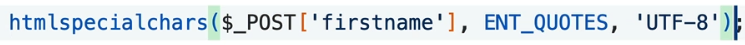

L’XSS è una tecnica di attacco in cui un hacker riesce a **iniettare codice
JavaScript malevolo** in una pagina web visualizzata da altri utenti. Questo
codice viene eseguito nel browser della vittima come se fosse parte legittima
del sito.

### 🎯 Obiettivi dell’attacco XSS

- **Rubare cookie di sessione** per impersonare l’utente
- **Reindirizzare** l’utente verso siti malevoli
- **Modificare il contenuto della pagina** per ingannare o truffare
- **Registrare input dell’utente** come password o dati sensibili

| Tipo          | Descrizione                                                                  |
| ------------- | ---------------------------------------------------------------------------- |
| **Reflected** | Il codice malevolo è incluso in un link e riflesso nella risposta del server |
| **Stored**    | Il codice viene salvato nel database e mostrato a tutti gli utenti           |
| **DOM-based** | L’attacco sfrutta il codice JavaScript lato client per manipolare il DOM     |

### Come difendersi

- **Sanificazione dell’input** : come nel tuo esempio, usare
  `htmlspecialchars()` in PHP
- **Validazione lato server** : controllare che l’input sia conforme a quanto
  previsto
- **Content Security Policy (CSP)** : limitare le fonti da cui può essere
  eseguito JavaScript
- **Escape dell’output** : evitare che l’input utente venga interpretato come
  codice
- ##################### **htmlspacialchars(); SPIEGAZIONE**
  ####################################

**htmlspecialchars(string $string, int $flags = ENT_QUOTES, string $encoding =
'UTF-8', bool $double_encode = true)**

- `$string`: la stringa da convertire (di solito input dell’utente)
- `$flags`: opzioni su quali caratteri convertire (es. `ENT_QUOTES` converte sia
  `'` che `"`)
- `$encoding`: la codifica dei caratteri (es. `'UTF-8'`)
- `$double_encode`: se `true`, converte anche entità HTML già codificate

  in questo modo ache se viene ignettato del codice Javascript non viene
  interpretato ma visto come una semplice stringa

  MOLTO PRATICO È RACCHIUDERLA IN UNA FUNZIONE IN MODO DA USARLA PIU VOLTE E MI
  RACCOMANDO SI USA SEMPRE !!!!!!!

  **BEST PRACTICE !!!!**


Questa é uno screen in cui usiamo un´**array** dove compariamo l´input
dell´**User** , in questo modo siamo sicuri che non ci sia **Injection** !!! in
quanto **prendiamo la risposta dell´user confrontandola con gli Items che
abbiamo nell´array in modo da far passare solo quelli e caricare la pagina
giusta** . Ricordiamoci che persone estranee **possono caricare nel path dei
file estranei** , in questo modo anche se lo fanno non é un problema . Anche il
metodo **POST** per quanto sicuro non riesce a darci una mano in questo campo

`htmlspecialchars()` e `rawurlencode()` sono due funzioni PHP che **sembrano
simili** perché entrambe "proteggono" stringhe, ma in realtà servono a **scopi
completamente diversi** .

### `htmlspecialchars()`

Serve per **proteggere l’HTML** da input utente potenzialmente pericoloso (come
script o tag).

#### Quando usarla:

- Quando **mostri dati utente** in una pagina HTML
- Per **prevenire XSS**
- In form, commenti, profili, ecc

### `rawurlencode()`

Serve per **preparare una stringa da inserire in un URL** , codificando i
caratteri speciali.

ATTENZIONE !!! una cosa molto importante quando usiamo questa function é che
dobbiamo inserire solo il nome del file , **non tutto il percorso del path**

ES:

**$file_name** = ' IMG522682.png '

**rawurlencode(' ../course/modern/altro/ ' . $file_name ) ; Come si puo vedere
la parte del percorso viene racchiusa in apici diversi e poi uniti al nome
!!!!**

#### Quando usarla:

- Quando **costruisci URL dinamici**
- Per **passare parametri via GET**
- Per evitare problemi con spazi, &, =, ecc.

##################################################
**http_build_query();** ###################################################

È una funzione che **trasforma un array associativo** in una stringa di
parametri **URL** (**query string**), pronta per essere usata in un **link** o
in una richiesta **HTTP**.

ES:

**$params = [ 'piatto' => 'Pizza', 'bevanda' => 'Birra', 'quantità' => 2 ];**

**query = http_build_query(params); echo $query;**

Output:

**piatto=Pizza&bevanda=Birra&quantit%C3%A0=2**

✅ I caratteri speciali (come à) vengono **codificati automaticamente** ✅ Puoi
usarla per costruire **URL** dinamici:

ES:

**url = " ordine.php? " . http_build_query ( params );** Come si vede questa é
una richiesta dinamica per URL

### **Quando usarla**

- Per costruire **URL** con parametri **GET**
- Per inviare dati via **API** o **cURL** ---> **cURL (Client URL)** è una
  libreria e set di funzioni che ti permette di comunicare con altri **server**
- Per **redirect** dinamici **(Ti posta in un´altra pagina)**
- Per evitare errori di codifica manuale
  ########################################### APPUNTO SU HREF
  ##############################################

## Quando usi `href` come **percorso statico**

Di solito scrivi:

`<a href="./images/foto1.jpg">`Apri immagine `</a>`

## Quando usi `href` con **query string (GET parameters)**

`<a href="image.php?image=foto1.jpg">`

Qui `href` non punta più a un file immagine, ma a uno **script PHP**
(`image.php`),

che riceve un **parametro GET** (`image=foto1.jpg`) e poi decide **cosa
mostrare**

Usare una query (`?image=foto1.jpg`) è utile quando:

- vuoi **gestire dinamicamente** le immagini da PHP
- vuoi **filtrare o modificare** le immagini (es. `?image=foto1.jpg&size=small`)
- vuoi **proteggere o validare** i file prima di mostrarli

| Caso                         | Esempio                                                      | Spiegazione IT                      | Erklärung DE                               |
| ---------------------------- | ------------------------------------------------------------ | ----------------------------------- | ------------------------------------------ |
| **Path diretto**             | `href="./images/foto.jpg"`                                   | apre direttamente il file           | öffnet direkt die Datei                    |
| **Con query (GET)**          | `href="image.php?image=foto.jpg"`                            | passa un parametro a uno script PHP | übergibt einen Parameter an ein PHP-Skript |
| **Con `http_build_query()`** | `href="image.php?image=foto.jpg"`ma generato automaticamente | costruisce l’URL in modo sicuro     | erstellt die URL sicher automatisch        |

############################################ **TYPE AND CASTING**
#######################################################

$numero = (int) "42"; // diventa intero $float = (float) "3.14"; // diventa
numero decimale $testo = (string) 123; // diventa stringa "123" $vero = (bool)
1; // diventa true $array = (array) $valore; // diventa array

**Function** per avere una risposta **booleana in base al tipo di value** , nel
Corso si vede come gli usa con un **IF** statement per dare la giusta istruzione
**in base al tipo** , in quanto un array non si comporta alla stessa maniera di
un stringa o di un´altro tipo .

    CASTING

**price = (int) $_GET[ ' parametro ' ];** Questo é il modo di castare il tipo di
dato ad una variabile !!!!!!!!!!

Qual´ora volessimo castare **INTEGER** ad una **Str** il risultato sarebbe '
**0** ' quindi **non da errore ma lo converte**

### **2️⃣ Casting implicito (implicit / automatische Umwandlung)**

PHP cambia tipo **automaticamente** quando serve:

**$somma = "10" + 5; // "10" viene convertito in 10 → risultato 15** converte da
solo se il contesto lo richiede.

    Conversioni più comuni in PHP

| Da → A          | Risultato                          | Spiegazione (IT)                       |
| :-------------- | :--------------------------------- | :------------------------------------- |
| `(int)"42"`     | `42`                               | Converte stringa numerica in intero    |
| `(int)"42abc"`  | `42`                               | Prende solo la parte numerica iniziale |
| `(int)"abc"`    | `0`                                | Nessun numero → diventa 0              |
| `(float)"3.14"` | `3.14`                             | Stringa numerica decimale → float      |
| `(float)"3,14"` | `3`                                | Virgola non valida → tronca a 3        |
| `(string)123`   | `"123"`                            | Numero → stringa                       |
| `(string)true`  | `"1"`                              | true → "1"                             |
| `(string)false` | `""`                               | false → stringa vuota                  |
| `(bool)0`       | `false`                            | 0 è falso                              |
| `(bool)1`       | `true`                             | 1 è vero                               |
| `(bool)"0"`     | `false`                            | Stringa “0” = false                    |
| `(bool)""`      | `false`                            | Stringa vuota = false                  |
| `(bool)"ciao"`  | `true`                             | Qualsiasi stringa non vuota = true     |
| `(array)123`    | `[0 => 123]`                       | Trasforma in array con indice 0        |
| `(object)123`   | `stdClass Object([scalar] => 123)` | Converte in oggetto                    |

############################################## NULL COALESCING OPERATOR ??
############################################

**Definizione:**

In PHP, l’operatore `??` serve per **verificare se una variabile è definita e
non è `null`** .

Se **non esiste** o è **null** , restituisce un **valore di default** .

**$variabile = $ $_GET['name'] ?? 'Anonimo';**

**Significa:**

> Se `$_GET['name']` esiste ed è diverso da `null`, assegna il suo valore.
>
> Altrimenti, assegna `'Anonimo'`.

##### **Confronto con `isset()`**

name = isset(_GET['name']) ? $_GET['name'] : 'Ospite';

##### è **equivalente** a:

$name = $_GET['name'] ?? 'Ospite';

**Più corto, più leggibile.**

################################## **ternary operator (operatore ternario)** ?
#########################################

**condizione ? valore_se_vero : valore_se_falso**

📖 Traduzione:

> “Se la condizione è vera → usa il primo valore,
>
> altrimenti → usa il secondo.”

**$name = isset($_GET['name']) ? $_GET['name'] : 'Ospite';**

- `isset($_GET['name'])` → controlla se esiste `$_GET['name']`.
- Se **vero** , prende `$_GET['name']`.
- Se **falso** , prende `'Ospite'`.

##### È come scrivere:

if (isset($_GET['name'])) { $name = $_GET['name']; } else { $name = 'Ospite'; }

| Scopo                                                          | Miglior scelta         | Esempio                               |
| -------------------------------------------------------------- | ---------------------- | ------------------------------------- |
| Controllare se una variabile esiste o è null → dare un default | ✅`??`                 | `$x = $_GET['id'] ?? 0;`              |
| Semplice condizione logica                                     | ✅`?:`                 | `$msg = $ok ? 'Successo' : 'Errore';` |
| Controlli complessi o validazione dei dati                     | ✅`isset()`o `empty()` | `if (empty($_POST['user'])) { ... }`  |

####################################### ' ICLUDE ' PICCALA TEORIA SU __DIR __
##############################################

Piccola annotazione per capire il ragionamento di PHP quando usa ' ICLUDE '


Per esempio ho questa situazione tra file diversi di cui due di questi file
hanno lo stesso nome , nel ' **a.php** ' ho una stringa che stampo come anche
nei due file ' **b.php** '

nel file ' **a.php** ' ho incluso con **include ();** il file ' **b.php** '
inserito nella cartella **/inc** .

Sfortunatamente viene incluso il file ' **b.php** ' esterno perché **PHP**
controlla prima la cartella esterna e poi va in profonditá per cercare nella
cartella **/inc** , quindi attenzione !!! **se avessi chiamato i due file con
nomi diversi tutto questo non sarebbe successo !!!**

**Un´altra possibile soluzione del problema potrebbe essere inserire il Path
assoluto del File , ma questo potrebbe generare un errore se un´altro User
utilizza il mio programma da Computer di marca differenti con smistamento
diverso di file rispetto al mio o se usano Software di Host diverso !!!!!!**

    BEST PRACTICE

Il modo migliore sarebbe di usare **__ DIR __** dentro l´include , quindi
**include __ DIR __ . '/b.php' ;** ora sappiamo che il **path** giusto é stato
assegnato e che quindi non ci saranno errori . **MI RACCOMANDO !!** se il File
da includere **non si trova nella stessa cartella aggiungere ' ../nome File '**
in modo da indirizzarlo bene .

**ES:**

Ricapitolando se volgio aggiungere ' b.php ' che sta **nella stessa cartella**
di ' a.php ' ---> **include __ DIR __ . ' /b.php '**

Se volgio aggiungere ' b.php ' che sta **nella cartella esterna** di ' a.php '
---> **include __ DIR __ . ' /../b.php '**


###### funziona così:

- `__FILE__` è il percorso completo del file corrente.
- `dirname(__FILE__)` prende solo la cartella in cui si trova quel file.
- `include` serve per inserire ed eseguire il contenuto di un altro file
  **PHP**.
- Quindi, il file `a.php` che si trova nella sottocartella `inc` viene incluso
  **in modo sicuro** , indipendentemente da dove viene eseguito lo script.

  ################################## **ALTRE FUNZIONI PER INCLUDERE FILE O
  FUNZIONI** ###############################

### 📌 `include`

- Inserisce un file PHP esterno.
- Se il file non esiste, **mostra un warning** ma il codice continua a
  funzionare.

### 📌 `require`

- Come `include`, ma più severo.
- Se il file non esiste, **genera un errore fatale** e **interrompe
  l'esecuzione** del codice.

### 📌 `include_once`

- Include il file **una sola volta** , anche se viene chiamato più volte.
- Evita problemi di **duplicazione di funzioni o variabili** .

### 📌 `require_once`

- Stessa logica di `include_once`, ma con la severità di `require`.
- Se il file è già stato incluso, lo **ignora** .
- Se il file non esiste, **interrompe l'esecuzione** .

💡 **Quando usarli?**

- Usa `require_once` per file essenziali (es. configurazioni, classi).
- Usa `include` o `include_once` per file opzionali (es. template, moduli
  extra).

################################ **USARE IL CONENUTO DI UN FILE CON
FILE_GET_CONTENTS() E READFILE()** ##################################

### `readfile()`

- **Cosa fa:** Legge un file e **lo stampa direttamente** sullo schermo.
- **Tipo di output:** Output immediato (non lo puoi manipolare).
- **Ritorno:** Restituisce il numero di byte letti, oppure `false` in caso di
  errore.
- **Uso tipico:** Serve per mostrare file statici (es. HTML, immagini, PDF)
  direttamente al browser.

### `file_get_contents()`

- **Cosa fa:** Legge tutto il contenuto di un file e lo **restituisce come
  stringa** .
- **Tipo di output:** Puoi salvarlo in una variabile e manipolarlo.
- **Ritorno:** Una stringa con il contenuto del file, oppure `false` in caso di
  errore.
- **Uso tipico:** Perfetto per leggere file di testo, JSON, XML, ecc., e poi
  elaborarli.


ES:

**usando un file chiamato `dati.txt` che contiene:**

Benvenuto nel mondo PHP!

##### Esempio con `readfile()`

**readfile('dati.txt');**

Questo **stampa direttamente** :

Benvenuto nel mondo PHP! ---> quidi non posso cambiare i suoi parametri

##### Esempio con `file_get_contents()`

**$testo = file_get_contents('dati.txt');
echo strtoupper($testo); // Lo trasforma in maiuscolo**

Questo **stampa**:

BENVENUTO NEL MONDO PHP! ---> lo manipolato per stamparlo in Uppercase !!!

    NOTARE COME USA     __ DIR __   ANCHE PER QUESTE FUNZIONI !!!!!!!


#################################################### **IMPLODE AND EXPLODE**
#########################################################


### `explode(delimitatore, stringa)`

- **Divide** una stringa in un array, usando il **delimitatore** come punto di
  separazione.
- Utile per spezzare **frasi, CSV, righe di testo, ecc.**

**ES:**

**$frase = "uno,due,tre"; $array = explode(",", $frase); // Risultato: ["uno",
"due", "tre"]**

### `implode(delimitatore, array)`

- **Unisce** gli elementi di un array in una **stringa** , separandoli con il
  delimitatore.
- Utile per creare stringhe da array **(es. per HTML, CSV, ecc.)**

**ES**:

**$array = ["uno", "due", "tre"]; $frase = implode("-", $array); // Risultato:
"uno-due-tre"**

    Parte finale della foto creazione della lista tramite implode

`<ul>`

`<li>`

<?php
echo implode ("</li><li>" , explode("\n", e($text)));            e();   --> funzione per controllare e filtrare User

?>

`</li>`

`</ul>`

🔍 Cosa succede qui:

1. `explode("\n", e($text))` divide il testo in righe.
2. `implode("</li><li>", ...)` unisce le righe, separandole con tag HTML `<li>`.

   1. Il risultato è una **lista HTML** con ogni riga del testo come **voce
      della lista** .

      ############################################ **ALTRE FUNZIONI PER
      MANIPOLARE STRING E ARRAY** ######################################

      substr(string$string, int $start, ?int $length = null);

- `$string` → la stringa originale
- `$start` → da dove iniziare (indice parte da 0)
- `$length` _(opzionale)_ → quanti caratteri prendere
- ES:

**$text = "Programmazione";**

###### // **Prende da posizione 0 i primi 4 caratteri**

echo substr($text, 0, 4); "Prog"

###### // **Prende da posizione 5 fino alla fine**

echo substr($text, 5); "ammazione"

###### // **Prende 3 caratteri partendo da posizione 2**

echo substr($text, 2, 3); "ogr"

    strlen();

**Serve per contare i caratteri presenti nella string in questione**

###### text = 'Parole';

**strlen(text);**

**var_dump(text);**

**int(6)**

**ATTENZIONE !!!! calcola i byte per cui se inserisci immagini emoticon o altro
che occupa piu spazio di una lettere il risultato non combaciera con il
conteggio esatto delle lettere**

    **str_starts_with(nome value , ' content da trovare ') & str_ends_with(nome value , ' content da trovare ')**

ES:

text = " PHP , short for \\"Hypertext Processor \\" , is a server-side scripting
language first introduced in 1994;

**var_dump(str_starts_with(text , ' PHP '));** -----> Risultato **TRUE** perche
incomincia con PHP

**var_dump(str_ends_with(text , ' PHP '));** -----> Risultato **FALSE** perche
non incomincia con PHP

**ATTENZIONE !!! Sono entrambe LOWER and UPPER CASE senitiv !!!**

    **strtolower(nome value) ;    -    strtoupper(nome value);   -   ucfirst(nome value);**

**strtolower(nome value) ;** ----> Converte tutto in Lower-case

**strtoupper(nome value);** -----> Converte tutto in Upper-case

**ucfirst(nome value);** ----> la prima lettera a il primo termine in Upper-case

    **trim (nome value , "simboli da eliminare");**

Serve per eliminare all´inizio e alla fine di una stringa **simboli o spazi
vuoti** , viene molto utilizzato per la parte **User** in modo da eliminare
parte scomode. Se si vuole eliminare solo spazi vuoti , basta solo inserire il
nome della string , oppure per eliminare altri simboli se devono specificare tra
virgolette dopo il nome della string in questiione

**ATTENZIONE !!!!!**

Esistono anche delle varianti di **trim ();**

**ltrim();** ----> per eliminare solo la parte sinistra

**rtrim();** -----> per eliminare solo la parte destra

    **strpos(nome value , " parola da cercare ", numero addizionale per indicare la posizione di partenza da dove si cerca );**

**Serve per cercare in una stringa una parola e ci restituisce l´index di dove
si trova** , ci sta anche la possibilitá d´inserire l´index di partenza !!! **Se
la parola in questione non esiste nella stringa ci ritorna un booleano FALSE**

    nl2br('PHP\n is amazing!');

Principalmente serve per formattare una stringa contenente **'\n'**, quindi per
ogni **'line-breack '** sostituisce con il **Tag HTML** `<br>` in modo da poter
stampare in libertá con echo o altre funzioni PHP

**ATTENZIONE !!!** ricordiamoci della function **ESCAPE** che abbiamo fatto nel
tutorial per convertire input o in genere ogni cosa in string , per agnientare
ogni possibile Javascript Injection . **Nel tutorial lo ha usato per fare la
conversione a stringa e quindi specifica di farlo prima di passare la stringa a
nl2br();**

**QUINDI :**

**nl2br(e(Stringa da passare )); --> Se lo avessimo fatto cosi : e(nl2br(Stringa
da passare )) sarebbe stato un errore !!!!**

    str_replace(parola o simbolo da cercare , parola o simbolo da sostituire , testo);

**Parametri:**

- `cerca` → la parola o carattere da trovare ( _zu suchender String_ )
- `sostituisci` → il nuovo valore ( _Ersatzstring_ )
- `testo` → la stringa originale dove cercare ( _ursprünglicher Text_ )

  ES:

  $testo = "Ciao mondo!"; $nuovo = str_replace("mondo", "PHP", $testo); echo
  $nuovo;

  OUTPUT:
- `Ciao PHP!`


**In questo caso lo ha usato come un array , in modo da cambiare piu parametri
OUTPUT : Hello Mars !!**


**Interessante é questo modo di usare questa function per splittare il testo in
piu string sostituendo \n con <\\p>** `b`

############################################################ **index**
######################################################

**Riassunto (Kurz gesagt):**

- È il **file predefinito** che il server mostra.
- “Index” = punto di partenza logico e tecnico.
- In PHP, è anche il **motore** che avvia l’applicazione web.

########################################### **NESTED ARRAYS**
##################################################################

**AVEVA DICHIARATO UNA ARRAY DI ARRAY IN CUI CI STAVANO DELLE INFORMAZIONI
RIGUARDO DEI CORSI DI LINGUA**


Interessante vedere questi Tag HTML e la loro funzione che viene mostrata in
basso :


**CREA UNA SPECIE DI DROPDOWN IN CUI CI STA UN PICCOLO RIASSUNTO E LA SUA
DIDASCALIA PRINCIPALE , SENZA L´USO DI JAVASCRIPT !!!**

cosi si presenta l´array di array :


**per chiamare gli array all´interno che sono associativi , basta chiamare
l´index principale e la chiave del secondo array che mi serve**

**Spanish_course = course [2]['Title'] ;** ---> in questo caso salvo nella
variabile il nome del corso

**Prova anche un Forech loop dove passa come dati chiave e valore di ogni
blocco**


come si vede fa prima un foreach normale , senza chiave , per chiamare ogni
blocco e poi ad ogni blocco chiamato passa in var_dump(); ogni chiave


Questo é un foreach (); solo per il terzo blocco !!!!

############################################################## **JSON &
COMPRESSED FILE** #############################################

Nel totorial fa vedere come prendere dei documenti json e stamparli o usarli con
php . Ora il primo metodo é usare **file_get_contents( path richiesto );** il
quale ristampa solo come stringa .

**$json = file_get_contents("data.json"); // legge il file
data = json_decode($json, true); // decodifica il contenuto**

##### data = json_encode($json); // lo trasforma in Json datai

Quinid come vedi prima convertila in stringa e poi usa **json_decode($json);**

IMPORTANTE !!! Se non metti il true dopo la value nelle parentesi comunque la
stampa ma non come array associativo , quindi ha una funzione diversa per esere
utilizzata

**`.bz2`** = compressione bzip2 (riduce le dimensioni del file) molto spesso i
file Json sono compressi in questa maniera perche di grande portata

##### filesize(__ DIR __ path); IMPORTANTE PER VEDERE LA MEMORIA !!!!

**phpinfo (); PER VEDERE TUTTE LE CONFIGURAZIONI E LIBRERIE CHE UNO HA !!!!**

**SCENARIO !!!**

Ora la situazione é questa , lui ha un bel po di file compressi **JSON** ,
compressi con .**bz2** molto comune per **Json** .

Per decomprimerli , in quanto non si puo leggere compresso , usa :

###### file_get_contents('compress.bzip2://' . __ DIR __ . ' path richiesto ');

Questo **compress.bzip2 : //** lo ha preso nella pagina caricata in **phpinfo
();** in quanto serve per prendere queste funzioni e lo ha trovato sotto la voce
**bz2** , campo

###### Stream Wrapper support


---

###### In PHP, padroneggiare gli _stream wrapper_ è utile per leggere dati da **URL, compressioni o input stream** senza librerie extra — molto usato in API e automazione.

### 📘 **Principali tipi di stream wrapper**

| Wrapper                      | Descrizione                                   |
| ---------------------------- | --------------------------------------------- |
| `file://`                    | file locali                                   |
| `http://`,`https://`         | risorse web                                   |
| `php://`                     | stream interni di PHP (stdin, output, memory) |
| `ftp://`,`zlib://`,`data://` | protocolli vari e compressione                |

### ⚠️ **Nota**

Se ricevi un errore tipo

> _“Stream wrapper support disabled”_
>
> vuol dire che **non è abilitato nel php.ini** (es. `allow_url_fopen = Off`).
>
> ES : $json = file_get_contents("https://example.com/data.json");
> $data = json_decode($json, true);
>
> Qui PHP usa il **stream wrapper `https://`** per leggere direttamente da un
> URL.

######################################################################################################################################


Interessante vedere come usa questo blocco per decodificare solo una parte del
file Json !!! in quanto $ data é gia un array , quindi é come se chiamo la
chiave associativa da dove parte il tutto

####################################################### **OPENDIR REDDIR
CLOSEDIR** #############################################

OPENDIR

Come prima cosa di dichiara una value in modo da chiamare la funzione e salvare
gli elementi racchiusi nella value (la aggior parte delle volte lo chiamano
Handle) :

**value = opendir(__ DIR __ . path relativo del file);** ---> ora questa value
contiene i file

per leggere i contenuti si fa **readdir(value); ATTENZINE !!! si deve arrivare
ai file , perch ei primi sono '. ' e '..' che sono le dir esterne , ogni volta
che facciamo readdir(); cambiamo lo stato e il valore della value in questione ,
passa da una all´altro file e quindi si deve chiamarla tante volte quante lo
desideriamo e poi fare . Ci sta da dire che se la dir é finita e la funzione non
ha altri file da passare ci restituisce false !!!!**

Per questo motivo entrano in gioco i for e while in modo da scorrere tutti i
file in maniera veloce

**opendir( __ DIR __ . path relatiovo del file);**

ES:

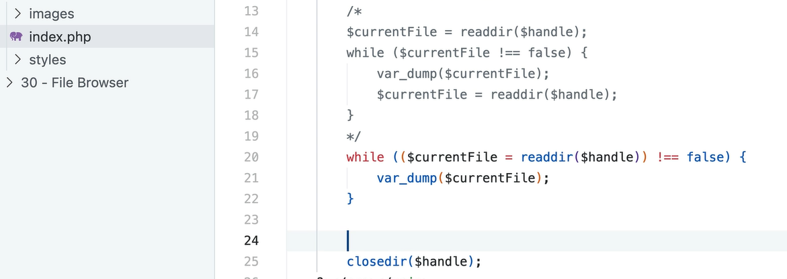

IN questa maniera la parte commentata viene ridotta e migliorata nella seconda
in quanto passa derettamente in While la value di una value

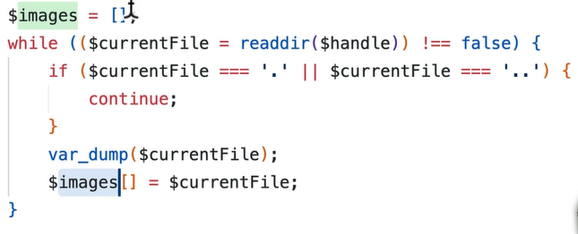

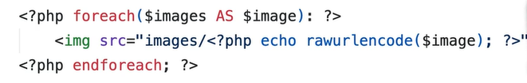

################################################################### PATHINFO()
################################################

**$info = pathinfo("/var/www/html/file.txt");**

**print_r($info);**

**Array ( [dirname] => /var/www/html [basename] => file.txt [extension] => txt
[filename] => file )**

 maniera veloce per chiamare
i valori dell´array

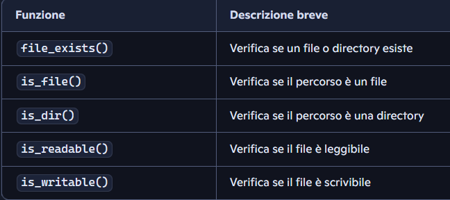

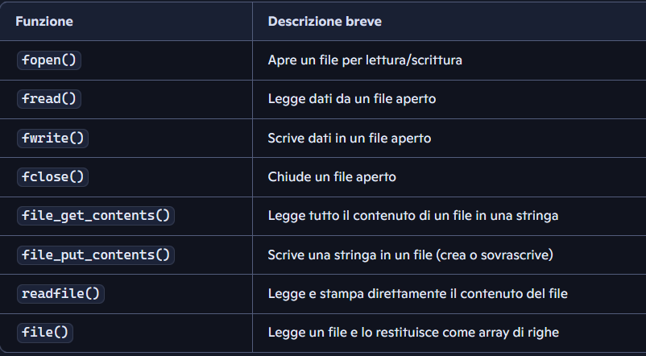

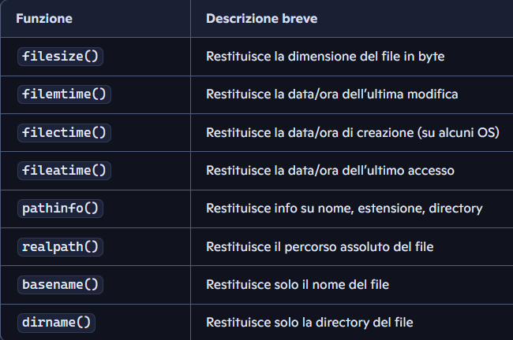

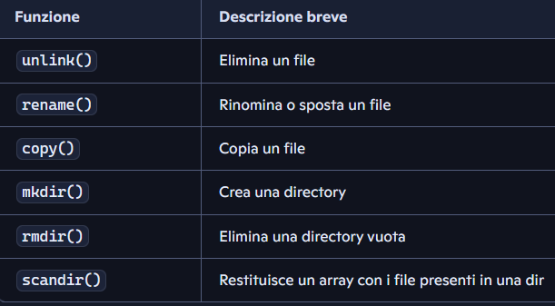

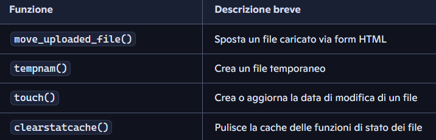

`basename()` è una **buona pratica di sicurezza** . UTILIZZA SOLO IL NOME DELL
FILE !!!! USARLO SEMPRE

########################################## DATABASE
################################################################################

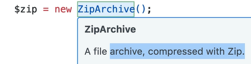

**Creazione di un file zip che i questo caso viene usato come Archivio , é un
ogetto perche fa parte di una classe quindi ha le sue Proprietá e funzioni**

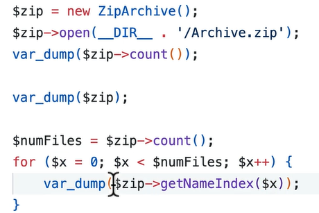

Come si puo vedere sta cercando di aprire l´archivio e leggere i fil el suo
interno

##################################### Database connection PDO();
################################################################

Anche questo é un´´ogetto che si chiama per fare il collegamento , Il best
Practise la value che chiama PDO() di regola si chiama anche cosi

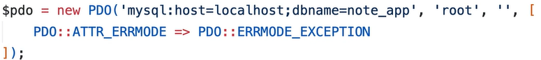

- `new PDO(...)`: crea una connessione al database
- `mysql:host=localhost;dbname=note_app`: indica il server e il nome del
  database
- `'root', ''`: sono username e password (vuota in questo caso)
- `PDO::ATTR_ERRMODE => PDO::ERRMODE_EXCEPTION`: imposta la modalità di errore
  per lanciare eccezioni (utile per il debug)

  BESTE PRACTICE FOR CONNECTION !!!!!

Sempre meglio farlo con il **try{} catch{}** per avere in modo istantaneo il
problema di connessione con il **Database !!!!** e sopratutto , qual´ora la
connesinoe fallisca non verrá riprodotta nel Browser dell´User tutti i parametri
inseriti nel PDO per fare la connessione , **ma solo il testo dell´exeption !!!!
MOLTO IMPORTANTE !!!**

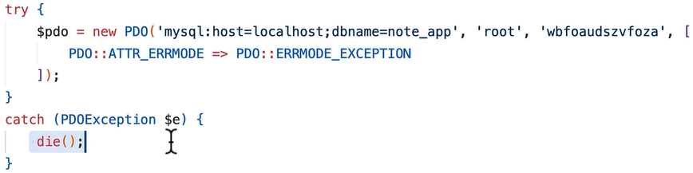

**e magari inserire un echo nel catch in modo da far visulizzare un testo con su
scritto che la connessione é fallita**

    $pdo--> prepare( SQLquery);

Dopo aver creato la connessione , creando l´oggetto **pdo = new PDO(' mysql:
host=localhost; dbname= nome_db' , 'root', 'password se esiste',[**

**PDO::ATTR_ERRMODE => PDO::ERRMODE_EXEPTION]);** ora utilizziamo un metodo
prepare(); che fa parte dell´OOP che mi serve per preparare le Query

**stmt = pdo -->prepare(Querystring); ATTENZIONE !!!! la si deve sempre inserire
in una value per poterla lavorare o non verra presa in considerazione**

    $stmt --> execute();

Altro metodo dell´object PDO che determina l´esecuzione della Query direttamente
al Datenbank. Questa non necessita di una value perche é stata gia racchiusa in
**stmt**

    $result = stmt --> fetchAll();

Dopo aver creato l´Object **$pdo** e aver racchiuso la **query SQL** nel stmt
che racchiude **prepare()** , dopo averla lanciata con **execute();** ora
procediamo a prendere la risposta del Datenbank **SOTTO FORMA DI ARRAY**
racchiusa in una value che chiameremo **result.**

**ATTENZIONE!!!** die default la risposta che abbiamo dal Database é una array
in cui per ogni dato della tabella , viene inserito due volte .Questo perche il
Database non sa come comportarsi , se l´User vuole un Array Associativo con la
chiave (che in questo caso sará il nome della colonna) o direttamente un Array
numerico in cui compaiono i risultati con index , tutto Questo occupa piu
memoria ovviamente. Per risolvere il tutto si puo dichiarare nel
**fetchAll(PDO::FETCH_ASSOC);** questo parametro che dichiara al Database
d´inviare i dati solo tramite **Array Associativo.**

**DOPO TUTTO QUESTO SI PUO UTILIZZARE IL NOSTRO ARRAY TRAMITE UN foreach(); o
con un while(); per avere i dati e utilizzarli al nostro piacimento**

    SQLinjection

Per opperire al possibile **SQLinjection** si puo fare un **Casting** del genere
int , nel caso la Query necessiti un numero (Ad esempio per in id o roba simile
), in modo da non avere problemi qual´ora qualcuno prova a fare un injection ,
in quanto tutto quello che scrive viene ignorato e **PHP** invia come parametro
**GET** solo il numero

ES :

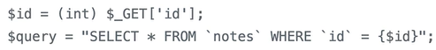

Questo metodo pero non é tanto sicuro in quanto é molto facile dimenticarsi il
casting per questo esiste il methodo:

**$stmt -->blindValue(' simbolo del placeholder generalmente ?', Get['nome
key']);**

In questo caso anche se ci sta un Injection , **SQL** prende la stringa
ignettata solo come una value del parametro da cercare , quindi in **default non
ascolta il resto che non é identificato come un numero e lo cancella**

ES:

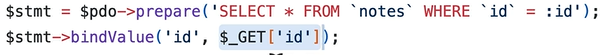

Ora possiamo tranquillamente eseguire con il metodo **execute();** e usare usate
il metodo **fetchAll(PDO::FETCH_ASSOC);** per avere i risulati

##### **

    Charset= 'utf8mb4'**

Inserirlo nei parametri della connessione di PDO per poter utilizzare caratteri
speciali e poterli processare

ES:

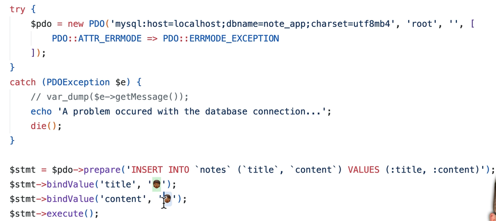

###### ########################################################### $_SERVER ARRAY

**Speciale Array** che mi serve per avere informazioni importante riguardo
all´**User** che visita i sito (**tipo IP o che tipo di browser utilizza** ) e
ad altre impostazioni base che i servono in determinati contesti


################################################## **Funzione `header()`**
#################################################################

Serve per **inviare intestazioni HTTP (HTTP Headers)** al browser **prima di
qualsiasi output**.

### **Cosa fa `Content-Type`**

`Content-Type` dice al browser **che tipo di contenuto** sta ricevendo (MIME
type).

👉 Qui: `text/plain` = **testo semplice** , senza HTML, CSS, formattazione.

🔸 Risultato:

Il browser **mostra il testo “così com’è”** , non interpreta tag HTML.


### **Altri tipi comuni**

| Tipo                       | Descrizione     | Effetto                     |
| -------------------------- | --------------- | --------------------------- |
| `text/html`                | Pagina web HTML | Il browser interpreta i tag |
| `application/json`         | Dati JSON       | Usato per API               |
| `application/pdf`          | File PDF        | Può aprire il lettore PDF   |
| `application/octet-stream` | Dati binari     | Forza il download           |

############################################### COME INVIARE I FILE ALL`USER???
#####################################################

###### utilizzo la funzione : 				header('Content-Disposition: attachment');

ES:


In questo caso ho :

- Impostato un header che dichiara i tipo di dato che é presente in questa
  pagina
- Imposto un header per il trasferimento File
- readfile(); funzoione che prende il file da una Cartella

  In questa maniera se ci premiamo sopra viene scaricato direttamente ATTENZIONE
  !!! la funzione **header('Content-Disposition: attachment, filename = nome che
  voglio dare ');** come puoi vedere ha il secondo parametro in cui dichiari che
  nome deve avere il file scaricato


Il terzo header serve per avere una visione aggiornata di quanto tempo ci vuole
per scaricare il file !!!!! MOLTO UTILE !!!!

Abbiamo detto che serve per inviare impostazioni al Browser per dichiarare che
tipo di risposta diamo e che tipo di contenuto é .

Ha un gosso problema dal punto di vista della sintassi, perche é molto sensibile
agli spazi vuoti e a piu informazioni o file inseriti insieme .

BEST PRACTICE :

Meglio non chiudere il `<?php       ?>` TAG , ma lasciarlo apertoe non scrivere
la parte finale .

ASSOLUTAMENTE SBAGLIATO lasciare spazio prima del´apertura del Tag !!!!!!

############################################################## **Funzione
`ini_get()`** ####################################################

##### Legge il valore di una **direttiva di configurazione di PHP (php.ini)** . ES: ini_get('output_buffering');

### **Cosa fa `output_buffering`**

`output_buffering` è una **direttiva del php.ini** che controlla come PHP
gestisce l’ **output buffering** .

- **Output buffering** = PHP **accumula** l’output (echo, print, HTML) **in
  memoria** prima di inviarlo al browser.
- Serve per **ottimizzare la velocità** e permettere di **modificare gli
  header** anche dopo aver generato del contenuto.

### **Perché è utile**

- Capisci **se PHP sta accumulando l’output** prima di inviarlo.
- Ti aiuta a **evitare errori come** :

  ❌ _“Cannot modify header information – headers already sent”_

  perché se l’output buffering è attivo, PHP può ancora aggiungere header dopo
  un echo.

################################################## LOCATION HEADER AND REDIRECT
USER TO FILE #####################################

### **Redirect in PHP**

➡️ Significa **reindirizzare l’utente** (browser) verso un’altra pagina o file.

In tedesco: **„Weiterleitung“** .

In italiano: **reindirizzamento** .

---

##### **header("Location: pagina.php");

**exit;**

🧩 Funziona così:

1. PHP invia al browser un **HTTP header** : `Location: nuova_pagina.php`
2. Il browser esegue **automaticamente** la nuova richiesta HTTP verso quella
   pagina.

`exit;` è importante → blocca il resto del codice dopo il redirect.

########################################################## HTTP STATUS CODE
########################################################

Si vede sempre con il Dev Tool f12 nella parte del Netwerk e sono numeri che
determinano lo stato della pagina e ppossibili errori


Nel Toturial a creato una pagina dove l´User viene indirizzato per visualizzare
l´errore , ora acnhe se la pagina ha un h1 che dice , pagina non trovata !!!,
comunque dal punto di vista DEV se si vede con il dev tool non ha codice **404**
ma **200**!!!.

Quindi questo non é una buona cosa in quanto il 200 non é errore , quindi lui
imposta sopra header html questo script che cambia lo stato della pagina


#### ################################################################## .htaccess

**Il file ** `.htaccess`** è un file di configurazione usato nei server Apache
per controllare il comportamento delle directory del tuo sito web. Serve per
gestire redirect, sicurezza, URL puliti e molto altro, senza toccare la
configurazione globale del server.**

### **A cosa serve ** `.htaccess`

- **🔁 Redirect** : Puoi reindirizzare URL vecchi a nuovi (es. da `http` a
  `https`, o da `pagina-vecchia` a `pagina-nuova`).
- **🔒 Sicurezza** : Bloccare accessi non autorizzati, proteggere directory con
  password, limitare IP.
- **🌐 URL rewriting** : Trasforma URL complicati in URL leggibili (es.
  `index.php?page=1` → `pagina/1`).
- **📄 Pagine di errore personalizzate** : Mostrare una tua pagina per errori
  come 404 o 403.
- **📦 Compressione e caching** : Migliora le performance del sito abilitando
  compressione GZIP e cache.


### ⚠️ **Attenzione**

###### * Funziona solo su **server Apache** (o compatibili).

- Un errore nella sintassi può **bloccare il sito** .
- Alcuni hosting potrebbero **limitare l’uso** di certe direttive.
- ############################################################### FUNZIONI
  ############################################### Importante per vedere se tra i
  nostri file esiste una funzione : **function_exists('nome funzione') ;** cosi
  siamo sicuri che il nostro programma non crasha!!!!

############################################################## Type
Declaration - Union Type #############################################


Possibilitá molto carina che ci da **PHP** é dichiarare il tipo di Parametro che
viene passato nella funzione , qundi é come avere un **casting** del parametro
che viene passato . È quasi una **Best PRACTICE** perche **PHP** la esegue di
sicuro e non ci sono errori e in piu la cosa importante e ricordarsi **dopo
pagine e pagine di codice** che tipo di **parametro** la function ha bisogno .

UNION TYPE

Semplicemente la possibilitá di avere piu tipi di dati che possono essere
acettati come parametro della funzione assegnata


Esiste anche il **Return Type** per quanto riguarda il **Type del valore che ne
esce** , per avere una documentazione al riguardo e per visualizzarlo nel
**Warning** o **fatal Error .**


Per far passare il parametro null nella funzione , quindi dichiarare che anche
il Type null puo essere acettato si usa il ? del tipo :


che alla fine significa :


**ATTENZIONE** !!! Questo funziona **solo se sono due Type** che passano , nel
caso ce ne fosse piu di uno si usa :

#### function print_5x( int|float|null )


**OCCHIO che si deve specificare il ritorno di NULL , se non ci da errore !!!!**

posso mettere anche **: void** come ritorno , in quanto **dichiaro che la
funzione non ritorna niente** , quindi :


    declare(strict_types = 1);

Questa riga dice a **PHP** di **usare controlli di tipo rigidi** .

➡️ Significa che se una funzione richiede un tipo specifico (es. `int`), non
accetta automaticamente altri tipi (es. `string` che contiene un numero).

**declare(strict_types = 1);**

**function somma(int $a, int $b): int { return $a + $b; }**

**echo somma(2, "3"); // ❌ Errore! "3" è una stringa**

ATTENZIONE !!!


### Cosa significa "passare per riferimento"?

Normalmente, quando passi una variabile a una funzione, PHP crea una **copia**
del valore. Quindi, se modifichi quella variabile all’interno della funzione,
**la variabile originale non cambia** .

Quando invece usi `&` ** davanti al parametro** , stai dicendo a PHP:

> **"Non creare una copia, lavora direttamente sulla variabile originale."**

############################################### REGULAR EXPRESSION
###############################


| **Comando / Simbolo**         | **Esempio PHP**                          | **Spiegazione IT / DE**                                            |
| ----------------------------- | ---------------------------------------- | ------------------------------------------------------------------ |
| `preg_match()`                | `preg_match("/cat/", "my cat")`          | ✅ Trova**una sola occorrenza**/ findet**nur das erste Vorkommen** |
| `preg_match_all()`            | `preg_match_all("/\d+/", "a1 b22 c333")` | ✅ Trova**tutte le corrispondenze**/ findet**alle Treffer**        |
| **Quantifiers**               | `/a*/`,`/a+/`,`/a?/`                     | `*`= 0+ volte,`+`= 1+ volte,`?`= 0 o 1 / Wiederholungen            |
| `^`e `$`                      | `/^Hi/`,`/end$/`                         | `^`= inizio stringa,`$`= fine stringa / Anfang & Ende              |
| `[abc]`,`[a-c]`,`[A-Za-z0-9]` | `/[A-Za-z0-9]/`                          | ✅ Set di caratteri permessi / erlaubte Zeichenmenge               |
| **Capture Group**             | `preg_match("/(\d+)/", "num 123", $m)`   | `( )`cattura parti di testo / fängt Teilstrings ein                |
| `preg_replace()`              | `preg_replace("/cat/", "dog", "my cat")` | 🔁 Sostituisce corrispondenze / ersetzt Treffer                    |

**Dritte / Consigli:**

- Usa **`https://regex101.com`** per testare i pattern.
- Impara i **metacaratteri principali** : `. ^ $ * + ? [] () {}`

  - Prova regex su testi reali (es. email, numeri, codici postali).

    ################################################### OOP
    ##########################################

    ##### 
        CLASSES

 i parametri dell´ogetto
vengono dichiarati specificando il metodo , ma si puo anche omettere in modo da
avere un parametro libero e che possiamo usare a nostro piacimento , comunque é
**BEST PRACTICE** dichiarare il tipo

**DEFAULT PARAMETER**


**CLASS WITH A METHOD UND $THIS SIGN FOR OBJECT**


ATTENZIONE !!!! notare come il nome della classe lo si scrive in Capitalize e il
metodo con Camelcase

##### 

    CONSTRUCTOR


##### 

    FORMA RIASSUNTIVA E MODERNA DEL COSTRUTTORE


**ATTENZIONE !!! probabilmente ha scritto il parametro del costruttore 'balance'
senza il this in quanto vuole dare un numero in DEFAULT in caso il numero é
negativo**

##### 

    PRIVATE AND PUBLIC

Una cosa molto importante é capire il concetto di **Public** e **Private** degli
attributi dell´ogetto . Se imposto come **Public** , allora **possono essere
acessibili anche al di furoi della classe** di riferimento (fuori inteso fuori
dalle loro parentesi graffe). Se non voglio cio , dovro impostare Private in
modo da **limitare l´acesso ad esse e creare magari i mie GETTER e SETTER** per
svolgere questa funzione

ATTENZIONE !!! ovviamente anche i metodi a loro volta possono avere questa
possibilitá , ossia essere Privati o Pubblici . Dipende tutto da come vogliamo
impostare il tutto

> `private` e `public` non servono a “bloccare l’accesso ai file”,
>
> ma a **creare regole di accesso** dentro il codice,
>
> così il programma resta **coerente, sicuro e più facile da mantenere** .

---

########################################################### NAMESPACES FOR CLASS
###############################################


**Cosa abbiamo fatto qua** , sto nel **File index.php** dove ho importato con
**require** i due file che contengono due classi diverse che si chiamano
**User** e potrebbero collidere . Per questo ho utilizzato il **Namespaces**
dandolo ad ogni calsse con il nome della cartella di riferimento in modo da
creare una distinzione . Qua vediamo in **index.php** che prima ho utilizzato il
comando **USE** per imporatre il **namespace Admin/User** in modo da poter
dichiarare liberamente l´ogetto appartenente a quella classe e poi ho dichiarato
un´altro ogetto appartenente al **Client/User** che peró deve essere dichiarato
col **Namespace** in modo da non avere **collisioni**


Ora ha utilizzato il comando **Use** anche per l´altro **namespace** in mono da
non dover scrivere ogni volta tutto quel nome per non avere collisioni e ha
usato 'as' per associare un´altro nome al secondo file che genera l´ogetto . Ora
tutto funziona e c´é una distinzione precisa che non permette la collisione
